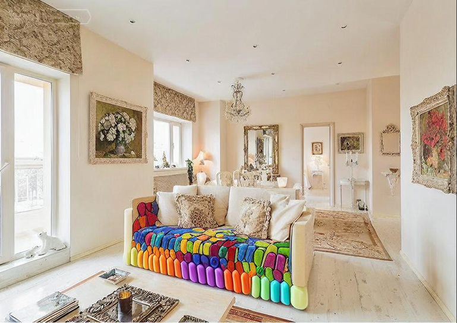
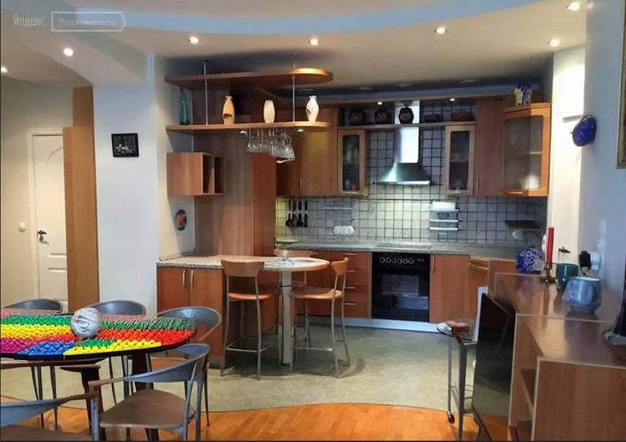
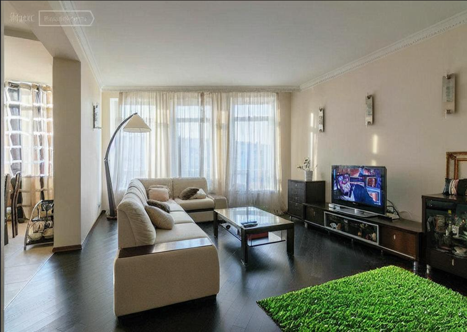

## ControlNet_Weight

Usage: need install Mask2Former, SAM, ControlNet, Depth Anything

library required: numpy, torch, diffusers,  transformers, matplotlib, cv2

This project introduces a novel method for dynamic image generation and manipulation using multi-modal inputs.
Using a combination of ControlNet and multi-modal weight
assignment, users can make adjustments to visual features
such as object prominence, position, and style.

Sample images:

